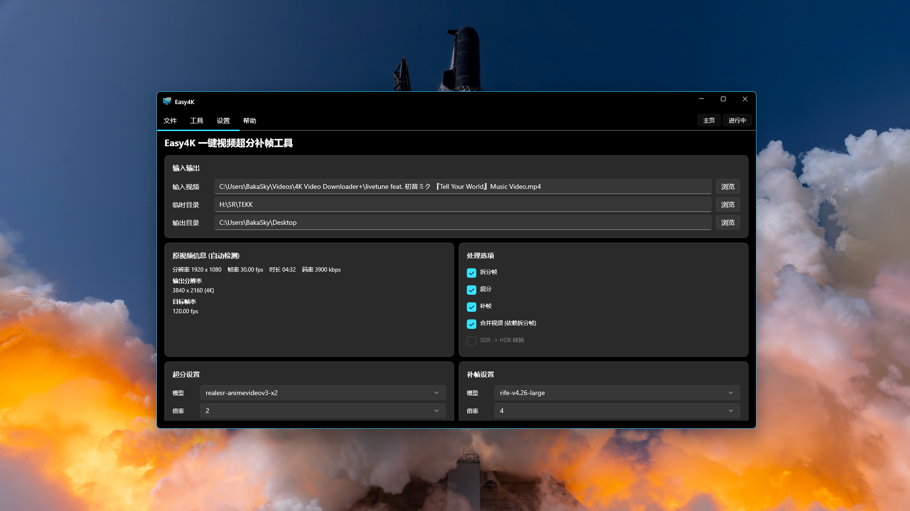

# Easy4K 一键视频超分补帧工具

基于 **WinUI 3 (Windows App SDK 2.4)** 的 Windows 桌面应用，一站式完成：

> **拆帧 → AI 超分 (Real-ESRGAN) → AI 补帧 (RIFE) → 合并视频 → 嵌入原音频 → (可选) SDR→HDR**

面向普通用户的图形化流水线工具：只需选择视频、勾选流程、点"开始处理"，即可把低分辨率/低帧率视频提升为高清高帧率视频。

---

## 功能特性

- **拆帧** — 使用 FFmpeg 将视频按原始质量逐帧导出 PNG
- **AI 超分** — 集成 Real-ESRGAN-ncnn-vulkan，支持 x2 / x3 / x4 倍率与多个模型
- **AI 补帧** — 集成 RIFE-ncnn-vulkan，支持 40+ 个 RIFE 模型，2 倍帧率提升
- **合并视频** — FFmpeg (libx265 / CRF 18) 将处理后的帧合成新视频
- **音频嵌入** — 自动提取原视频音轨并嵌入新视频（PCM 24bit / 96kHz）
- **SDR→HDR** — NVIDIA RTX 显卡可开启（NVEncC 驱动），非 RTX 自动禁用
- **实时进度** — 每阶段独立进度条 + 逐帧计数 + 实时日志
- **CPU/GPU 监控** — 实时显示占用率（环形进度指示器）
- **预览图** — 处理过程中实时预览最新帧（新帧加载完成前保持旧帧，不闪烁）
- **断点续传** — 已完成的阶段自动跳过，中断后重开可复用中间结果
- **临时文件清理** — 一键清理中间产物，带成功/失败结果提示
- **关闭保护** — 处理中关闭窗口会弹窗确认，选择"关闭"将强制终止所有子进程
- **主题切换** — 浅色 / 深色 / 跟随系统，自动保存

## 环境要求

- Windows 10 1809 或更高版本 / Windows 11
- 支持 **Vulkan** 的显卡：NVIDIA / AMD / Intel（AMD RX 580 等实测可跑）
- SDR→HDR 转换需 NVIDIA **RTX 20/30/40/50** 系列 + NVEncC ≥ 9.32（非 RTX 自动禁用）
- 建议 8GB+ 内存；超分 4K 视频建议 6GB+ 显存（低显存自动降低线程重试）

## 截图



## 快速开始

1. 双击 `Easy4K.exe` 启动
2. 点击 **"浏览"** 选择要处理的视频（mp4 / mkv / avi / mov）
   - 程序自动探测分辨率、帧率、时长、总帧数
3. 勾选要执行的流程：
   - **拆分帧** — 其他流程的依赖，会自动强制勾选
   - **超分** — AI 放大分辨率（模型 + 倍率 2/3/4）
   - **补帧** — AI 提升流畅度（模型 + 倍率 2）
   - **合并视频** — 将处理后的帧合成为视频
   - **将原音频合并进新视频** — 自动提取原音轨嵌入
   - **SDR -> HDR 转换** — 仅 RTX 显卡可用，否则自动禁用
4. 选择超分模型（按倍率自动过滤）与补帧模型
5. 点击 **"开始处理"**（快捷键 `Ctrl+S`）
   - 处理中实时查看：阶段进度、逐帧进度、预览图、命令日志、CPU/GPU 占用
6. 输出文件位于 `Output/` 目录

### 输出命名规则

| 场景 | 文件名 |
| --- | --- |
| 仅合并 | `{原名}_SDR.mkv` |
| 超分 + 补帧 | `{原名}_{分辨率}_{帧率}fps_SDR.mkv` |
| 嵌入音频 | 追加 `_音频嵌入` 后缀 |
| HDR | 后缀为 `_HDR` |

## 界面说明

### 主页
- **视频信息区** — 输入视频路径、分辨率、帧率、时长、总帧数
- **处理选项区** — 勾选流程（拆帧/超分/补帧/合并/音频/HDR）
- **参数区** — 超分与补帧的模型、倍率选择
- **输出预览区** — 自动计算的输出分辨率与目标帧率

### 进行中
- **进度条** — 当前阶段整体进度（拆帧/合并/超分/补帧/HDR 各自独立）
- **预览图** — 实时展示最新产出的帧（解码完成前保留旧帧，避免闪烁）
- **命令日志** — 全部子进程实时输出，支持多行选择、滚动到底部、自动裁剪（最多保留 200 行）
- **CPU/GPU 监控** — 实时占用率环形指示器

## 功能细节

### 进度显示
- **拆帧 / 合并**：解析 FFmpeg `frame=xxx` 实时帧数（兼容 `\r` 覆盖写输出）
- **超分**：轮询输出目录帧数 + 解析 stderr 百分比，进度平滑
- **补帧**：轮询输出目录帧数
- **HDR**：NVEncC 百分比

### 日志
- 每条命令完整输出（含 stderr），带时间戳与级别着色
- "复制日志"一键复制全部日志到剪贴板；"清空"清屏
- 日志文本可选中复制单条

### 断点续传
已完成的阶段（帧数足够）会自动跳过。处理中断后重新开始可复用中间结果，避免重复计算。

### 菜单
- **文件**：打开视频 / 选择临时目录 / 选择输出目录 / 退出
- **工具**：检查环境 / 检查显卡 / 清理临时文件
- **设置**：浅色 / 深色 / 跟随系统 主题
- **帮助**：使用说明 (F1) / 快捷键 / 关于

### 快捷键

| 快捷键 | 功能 |
| --- | --- |
| `Ctrl+O` | 打开视频 |
| `Ctrl+S` | 开始处理 |
| `Ctrl+Shift+S` | 停止处理 |
| `Ctrl+L` | 清空日志 |
| `F1` | 帮助 |

## 打包 / 部署

应用为 **Unpackaged (WindowsPackageType=None) + 自包含 (WindowsAppSDKSelfContained)**，全部依赖随 exe 一起分发。

### 目录结构（发布后）

```
Easy4K/
├── Easy4K.exe                  # 主程序
├── appsettings.json            # 配置（工具路径、默认模型、线程数等）
├── Assets/                     # 应用资源（图标等）
├── FFmpeg-Lei/                 # FFmpeg 工具（ffmpeg.exe / ffprobe.exe）
├── realesrgan-ncnn/            # Real-ESRGAN 工具 + models/
├── rife/                       # RIFE 工具 + 全部模型子目录
├── NVEncC_9.32_x64/            # NVEncC (HDR 编码)
├── Temp/                       # 处理中间产物（帧序列）
└── Output/                     # 最终输出视频
```

> 工具与模型**直接放在 exe 同目录**（或 exe 旁的 `Tools/` 子目录），随软件自包含分发，无需安装、无需配置环境变量。
> 程序启动时按以下顺序自动定位工具根目录：
> `exe\Tools\` → `exe\`（根下直接放工具）→ 向上逐级查找 → 开发期兜底路径。

### 从源码构建

要求：.NET SDK 10 + Windows App SDK 2.4 支持

```powershell
cd src/Easy4K
dotnet build -c Debug -r win-x64
```

发布：

```powershell
dotnet publish -c Release -r win-x64
```

- 应用图标通过 `<ApplicationIcon>Assets\AppIcon.ico</ApplicationIcon>` 嵌入 exe
- 打包前需把 `Tools/` 下 4 个工具目录复制到输出目录（`bin\...\win-x64\`）与 exe 同级
- 开发期间工具位于仓库根 `Tools/`，运行时自动向上查找定位

## 命令行自测模式（开发 / 排障用）

```
Easy4K.exe --selftest <输入视频> <报告文件> [阶段掩码]
```

阶段掩码（位运算）：

| 值 | 阶段 |
| --- | --- |
| 1 | 拆帧 |
| 2 | 超分 |
| 4 | 补帧 |
| 8 | 合并 |
| 16 | 音频 |
| 15 | 全流程（默认） |

示例：

```powershell
Easy4K.exe --selftest "C:\test.mp4" "C:\report.txt" 15
```

自测会自动清理临时目录、勾选对应流程并跑完整链路，结束后把全部日志写入报告文件并退出，便于自动化验证。

## 模型说明

### 超分（Real-ESRGAN）

| 模型 | 倍率 | 特点 |
| --- | --- | --- |
| `realesr-animevideov3` | x2 / x3 / x4 | 动漫/视频通用，速度最快（默认推荐） |
| `realesrgan-x4plus` | x4 | 通用照片/视频，画质最高（较慢） |
| `realesrgan-x4plus-anime` | x4 | 动漫专用 |

### 补帧（RIFE）

默认推荐 `rife-v4.6`（兼容性最好）。内置 40+ 模型：
`rife-v2` / `v2.3` / `v2.4` / `v3.x` / `v4.x`（含 `-lite` / `-HD` / `-UHD` / `-anime` / `-large` / `-heavy` 变体）。

- 新版模型（如 v4.25 / v4.26）画质更好，但需要 8GB+ 显存
- 显存不足时软件会给出警告；RIFE 模型不支持当前显卡时会自动回退默认模型
- 低显存显卡运行大模型失败时自动降线程重试

## 处理链路（技术说明）

```
拆帧   ffmpeg -q:v 2                       → Temp/input_frames/%08d.png
超分   realesrgan-ncnn-vulkan -n {模型} -s {倍率} → Temp/4k_frames
补帧   rife-ncnn-vulkan -n {总帧数} -u       → Temp/output_frames
合并   ffmpeg -framerate {fps} -start_number 1 libx265 -crf 18
音频   提取 flac → 嵌入 pcm_s24le 96000Hz 双声道
HDR    NVEncC64 SDR→HDR（仅 RTX）
```

## 常见问题

**Q1: 点"开始"没反应 / 提示"请先选择有效的输入视频"**
→ 必须通过"浏览"选择视频（路径框为只读，不可手动输入）。

**Q2: 处理到某阶段卡住不动**
→ 日志中若只有启动命令而无输出，多为外部工具异常。可先"清理临时文件"后重试。
→ AMD 显卡偶发 ncnn-vulkan 随机停滞，属已知问题，升级驱动可缓解。

**Q3: HDR 选项为灰色**
→ 非 RTX 显卡自动禁用（SDR→HDR 依赖 NVEncC + Tensor Core）。

**Q4: 输出是 `_SDR.mkv` 而不是 `_HDR`**
→ 显卡不支持或 NVEncC 未安装时自动回退 SDR。

**Q5: 日志太多看不清**
→ 日志自动裁剪（保留最近 200 行）；点"清空"清屏；"复制日志"导出分析。

**Q6: 程序崩溃**
→ 查看 exe 同目录 `crash.log`，其中记录了异常堆栈，可提交 issue 附上该文件。

**Q7: 处理中关窗会怎样？**
→ 弹窗确认。选择"关闭"将强制终止 FFmpeg/Real-ESRGAN/RIFE/NVEncC 等全部子进程后退出；选择"取消"继续处理。

## 技术栈

- **框架**：WinUI 3 / Windows App SDK 2.4（`Microsoft.WindowsAppSDK` 2.4.0）
- **语言**：C# / .NET 10（`net10.0-windows10.0.26100.0`）
- **MVVM**：CommunityToolkit.Mvvm 8.4.0（`[ObservableProperty]` + 编译期 `x:Bind`）
- **外部工具**：FFmpeg、Real-ESRGAN-ncnn-vulkan、RIFE-ncnn-vulkan、NVEncC

## 许可 / 致谢

- [Real-ESRGAN](https://github.com/xinntao/Real-ESRGAN)（BSD-3-Clause，ncnn 版本由 nihui 提供）
- [RIFE / rife-ncnn-vulkan](https://github.com/nihui/rife-ncnn-vulkan)
- [FFmpeg](https://ffmpeg.org/)（LGPL/GPL）
- [NVEncC](https://github.com/rigaya/NVEnc)（MIT）
- [ncnn](https://github.com/Tencent/ncnn)
